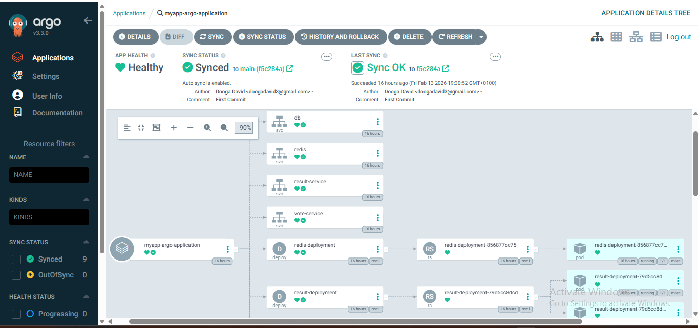
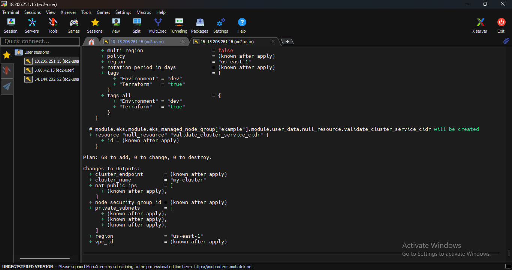
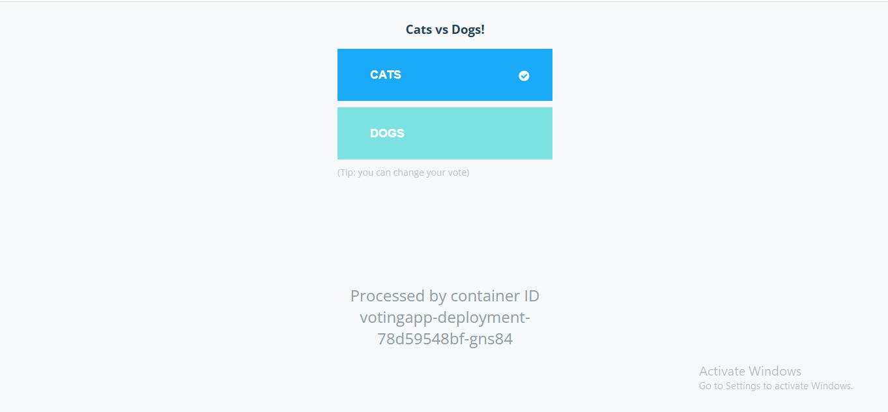

# 🗳️ EKS Microservices: The GitOps Standard
### Multi-Tier Orchestration with Terraform & ArgoCD

[](https://aws.amazon.com)
[](https://www.terraform.io)
[](https://argoproj.github.io)

This project represents a production-ready transition from manual `eksctl` deployments to a fully automated **Infrastructure-as-Code (IaC)** and **GitOps** lifecycle. It manages a 5-tier microservices stack (Python, Node.js, .NET, Redis, Postgres) on a hardened Amazon EKS cluster.

---

## 🏗️ System Architecture

<p align="center">
  
  <br>
  <em>Figure 1: ArgoCD Real-time synchronization of the Microservices Tree.</em>
</p>

### 🛠️ Infrastructure Core (Terraform)
The foundation is built on **Terraform**, utilizing modular HCL to provision:
*   **Isolated VPC:** 3 Public Subnets (NAT/IGW) and 3 **Private Subnets** (EKS Nodes).
*   **Security Posture:** Zero-trust Network ACLs and Security Groups. Nodes have **No Public IPs**.
*   **Modern Auth:** Leverages the **EKS Pod Identity Agent** (the new AWS standard) for granular IAM-to-Pod mapping, replacing legacy OIDC/IRSA.

### 💾 Data Persistence & Storage
*   **Driver:** AWS EBS CSI Driver (v21 Managed Add-on).
*   **StorageClass:** `gp3` with `volumeBindingMode: WaitForFirstConsumer`.
*   **Workload:** **PostgreSQL 18** managed via **StatefulSets** to ensure stable network identity and persistent disk attachment across pod restarts.

---

## 🚀 The Microservices Stack

| Service | Language/Stack | Role | Access Type |
| :--- | :--- | :--- | :--- |
| **Vote** | Python / Flask | User Interface | `Loadbalancer` |
| **Result** | Node.js | Real-time Dashboard | `Loadbalancer` |
| **Worker** | .NET Core | Task Processing | Internal Only |
| **Redis** | In-memory | Message Broker | Internal Only |
| **Database** | PostgreSQL 18 | Persistent Storage | **StatefulSet** |

---

## 🔄 GitOps Workflow
We utilize **ArgoCD** for Continuous Deployment. The cluster's state is strictly defined by the manifests in this repository.

1.  **Code Change:** Developer pushes a change to GitHub.
2.  **Detection:** ArgoCD identifies the `OutOfSync` status.
3.  **Reconciliation:** ArgoCD applies changes and performs a **Self-Heal** if manual drift is detected.

<p align="center">
  
  
  
</p>

---

## 🚦 How to Deploy

### 1. Provision Infrastructure
Refer to the [Terraform Repository](https://github.com/hashicorp/terraform ) to build the VPC and Cluster.

### 2. Bootstrap ArgoCD
```bash
kubectl create namespace argocd
kubectl apply -n argocd -f application.yaml

